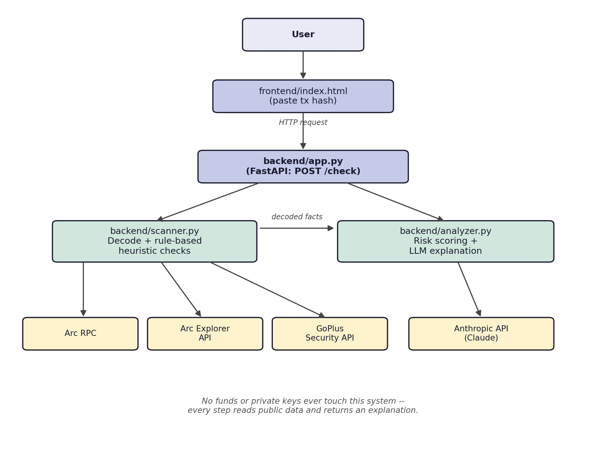

# Arc Transaction Safety Checker

Paste a transaction, find out whether it's safe to sign — in plain English.

Built for the [Arc Microgrants](https://dorahacks.io/hackathon/arc-microgrants) program (Circle / DoraHacks).

**Part 1 is for anyone. Part 2 is for developers.**

---

# Part 1: What this is, in plain English

## The problem

Using crypto means constantly clicking "approve" or "confirm". Those
confirmation screens are full of computer code that almost nobody can read —
including people who have used crypto for years.

Scammers rely on exactly that confusion. They get people to approve something
that quietly hands over permission to take their money. Often nothing happens
straight away. The money disappears days or weeks later, long after the person
has forgotten they clicked anything. There is no undo button, and no bank to
call.

## What this tool does

You paste in a transaction before approving it. It answers one question:
**is this safe to sign?**

You get a short sentence with no jargon, and a clear recommendation. Real
output from the tool:

> This lets 0xa05818C8… spend your tokens at any time, in any amount, for as
> long as you leave the permission in place. That address was created less
> than an hour ago.
>
> **Do not sign this transaction**

Compare that to a safe one:

> This sends funds to 0x7F992cf8… It does not give anyone ongoing permission
> to spend your money.
>
> **Safe to proceed**

Three possible answers: **Safe to proceed**, **Proceed with caution**, or
**Do not sign this transaction**.

## What it checks

1. **Does this give someone unlimited access to your money?** The most common
   trap. A normal payment moves a fixed amount once. A dangerous approval
   hands over permission to take any amount, at any time, forever.
2. **How new is the address receiving that permission?** Scam contracts are
   usually brand new. A legitimate app has usually existed for months.
3. **Is the address already known for scams?** Checked against an outside
   security service that tracks reported addresses.

## How much you can trust it

The decision is made by fixed rules, not by AI guessing. The AI is only used
to write one sentence in plain English, and it is never allowed to change the
verdict — it cannot decide something dangerous is safe. If the AI is switched
off entirely, the tool still works and gives the same answers.

It never touches your money. It cannot move funds, and it never sees your
password or recovery phrase. It only reads public information.

## What it does not do yet

Built in a few days for a grant submission, not a finished product. It does
**not**:

- Pop up automatically inside your wallet — you paste transactions in by hand
- Catch every scam — it focuses on one very common, very costly pattern
- Maintain its own scam database — it relies on an outside service

On Arc's main network, the "how new is this address" check is currently
unavailable because the network's public records aren't openly accessible yet.
The tool says "we could not check" rather than guessing — see Part 2.

---

# Part 2: For developers

## How it works

```
User → frontend/index.html → backend/app.py  (POST /check)
                                   │
                    ┌──────────────┴──────────────┐
                    ▼                             ▼
            backend/scanner.py            backend/analyzer.py
         decode calldata + gather        score the facts, then
         facts (deterministic)           explain them
                    │                             │
         Arc RPC, Explorer API,          templates (normal case)
          GoPlus Security API            backend/llm.py (unknown calls only)
```



The whole system is read-only. It holds no funds and no keys, which keeps the
security surface small.

**The important boundary:** `scanner.py` decides what a transaction *does*,
using ABI decoding and API lookups. `analyzer.py` turns those facts into a
score and a sentence. **No language model contributes to the score**, ever.
See [Design decisions](#design-decisions).

## Project layout

```
arc-transaction-safety-checker/
├── README.md                — you are here
├── requirements.txt         — Python dependencies
├── .env.example             — config template (copy to .env)
├── backend/
│   ├── scanner.py           — decode calldata + rule-based checks → facts
│   ├── analyzer.py          — facts → score, band, recommendation, wording
│   ├── llm.py               — swappable LLM provider (wording only)
│   └── app.py               — FastAPI app, one route: POST /check
├── frontend/
│   └── index.html           — paste-and-check page, no build step
└── tests/
    └── test_transactions.py — manual sanity-check harness
```

## Setup

```bash
git clone <this-repo>
cd arc-transaction-safety-checker

python -m venv .venv
source .venv/bin/activate         # Windows: .venv\Scripts\activate

pip install -r requirements.txt

cp .env.example .env
```

Then pick a network below and fill in `.env`.

> Verified on Python 3.14 with `web3` 8.0.0, `anthropic` 1.7.0 and
> `hexbytes` 2.0.0. Note that `hexbytes` ≥1.0 dropped the `0x` prefix from
> `.hex()`, which silently breaks ABI decoding — `scanner.normalize_calldata()`
> exists because of it, so pass `tx["input"]` through rather than `.hex()`.

## Choosing a network

This matters more than it looks: **the two networks do not offer the same
capability**, because contract-age data is only reachable on testnet.

|                              | Testnet                             | Mainnet                          |
| ---------------------------- | ----------------------------------- | -------------------------------- |
| Chain ID                     | `5042002`                           | `5042`                           |
| RPC                          | `https://rpc.testnet.arc.io`        | `https://rpc.mainnet.arc.io`     |
| Explorer API                 | `https://explorer.testnet.arc.io`   | none public (see below)          |
| Unlimited-approval check     | works                               | works                            |
| Known-scam check (GoPlus)    | works                               | works                            |
| Contract-age check           | **works**                           | **unavailable**                  |
| Highest reachable verdict for an unlimited approval | **HIGH (60)** — "Do not sign" | MEDIUM (35) — "Proceed with caution" |

Mainnet's `explorer.arc.io` serves `/api` behind a Cloudflare bot challenge, so
a server-side client receives an HTML challenge page instead of JSON. Real API
access has to come from Arc/Circle. Until then `contract_age_hours` is always
`None` on mainnet, the `fresh_contract` signal never fires, and mainnet runs on
two of its three signals.

**So: demo on testnet, where all three signals work. Use mainnet for real
transaction data, knowing the age signal is dark.**

### Testnet config

```bash
ARC_RPC_URL=https://rpc.testnet.arc.io
ARC_CHAIN_ID=5042002
ARC_EXPLORER_API_BASE=https://explorer.testnet.arc.io
ARC_EXPLORER_CHAIN_ID=5042002
```

### Mainnet config

```bash
ARC_RPC_URL=https://rpc.mainnet.arc.io
ARC_CHAIN_ID=5042
ARC_EXPLORER_API_BASE=
ARC_EXPLORER_CHAIN_ID=
```

> **Change all four together.** `ARC_EXPLORER_CHAIN_ID` must match the chain the
> RPC serves or the explorer is ignored outright. This is a safety check, not
> pedantry: addresses collide across chains (2 of 11 sampled Arc mainnet
> contracts also have code at the same testnet address), so a testnet explorer
> answering about a mainnet address can return a creation date belonging to a
> completely different contract — making a brand-new scam contract look
> established and silently downgrading a HIGH verdict to MEDIUM.

`.env` ships with both profiles, testnet active and mainnet commented out.

## Running it

```bash
cd backend
uvicorn app:app --reload --port 8000
```

Check it came up, and confirm which network and model it's using:

```bash
curl http://localhost:8000/health
# {"connected_to_arc":true,"llm_provider":"groq","model":"openai/gpt-oss-120b"}
```

Then open `frontend/index.html` in a browser. Its `API_BASE` defaults to
`http://localhost:8000`.

## Testing

### Quick check (either network)

```bash
python -m tests.test_transactions
```

This runs three real transactions through the full pipeline and prints the
facts, score, band, wording, and where the wording came from. The bundled
hashes are **testnet** transactions — on mainnet they won't resolve, so replace
them with mainnet hashes (see below).

Expected on testnet:

| Case               | Score | Band   | Recommendation       |
| ------------------ | ----- | ------ | -------------------- |
| Plain transfer     | 0     | SAFE   | Safe to proceed      |
| Bounded approval   | 0     | SAFE   | Safe to proceed      |
| Unlimited approval | 35    | MEDIUM | Proceed with caution |

The third case is MEDIUM rather than HIGH because its spender is an
established contract. HIGH requires unlimited approval **and** a contract
younger than 24 hours.

### Testing on testnet (full capability)

1. Set the testnet config above.
2. Start the API and confirm `/health` shows `connected_to_arc: true`.
3. Run `python -m tests.test_transactions` — all three cases should pass.
4. **To see the HIGH verdict**, you need an unlimited approval to a
   freshly-deployed contract. Deploy any throwaway contract to Arc testnet,
   then send an `approve()` call to it with `amount = 2**256 - 1`, and check
   that transaction hash. While the spender is under 24 hours old you get:

   ```
   60/100 HIGH — Do not sign this transaction
   ```

5. Check a transaction over HTTP:

   ```bash
   curl -X POST http://localhost:8000/check \
     -H "Content-Type: application/json" \
     -d '{"tx_hash":"0x..."}'
   ```

**Testnet explorer rate limit:** the Etherscan-compatible `/api` allows about
10 requests before returning HTTP 429 for roughly 17 minutes. The code falls
back to Blockscout's unthrottled `/api/v2` automatically, and caches every
successful lookup, so this rarely bites — but if contract ages start coming
back `None` under heavy use, that's why.

### Testing on mainnet

1. Set the mainnet config above. Leave both explorer variables **empty**.
2. Restart the API. `/health` should still show `connected_to_arc: true`.
3. Find real mainnet transactions to test with — unlimited approvals are
   common (a scan of 300 consecutive mainnet blocks found 38 of them among 87
   `approve()` calls):

   ```bash
   python - <<'PY'
   import sys; sys.path.insert(0, "backend")
   from web3 import Web3
   import scanner

   w3 = Web3(Web3.HTTPProvider("https://rpc.mainnet.arc.io"))
   latest = w3.eth.block_number
   for n in range(latest, latest - 300, -1):
       for tx in w3.eth.get_block(n, full_transactions=True).transactions:
           if not tx["to"]:
               continue
           decoded = scanner.decode_function_call(w3, tx["to"], tx["input"])
           if decoded and decoded["params"].get("amount") == scanner.MAX_UINT256:
               print("unlimited approval:", "0x" + tx["hash"].hex().removeprefix("0x"))
               raise SystemExit
   PY
   ```

4. Put those hashes into `TEST_CASES` in `tests/test_transactions.py` and run
   it, or POST them to `/check`.
5. **Expect `contract_age_hours: None` and a MEDIUM ceiling.** That is correct
   behaviour on mainnet, not a bug — the tool reports "We could not check how
   long that address has existed" rather than inventing a number.

## Swapping the AI provider

The model that writes the sentence is config, not code:

```bash
LLM_PROVIDER=groq        # anthropic | groq | grok | gemini | openai
GROQ_API_KEY=...
LLM_MODEL=               # blank uses that provider's default
```

`groq` (api.groq.com, open models) and `grok` (xAI) are different services —
easy to confuse, so both are supported separately.

Everything except Anthropic speaks the OpenAI-compatible `/chat/completions`
shape, so adding a vendor — or a local model server — is one entry in
`PROVIDERS` in `backend/llm.py`.

**The provider is optional.** With no key configured the checker runs entirely
on rules and returns the same verdicts; only the wording on undecodable calls
degrades to a fixed line. Every response reports `explanation_source`:
`rules`, `model`, or `unavailable`.

## How the score works

`analyzer.py` adds up whichever signals apply, caps at 100, then maps to a
band. All of it is deterministic.

| Signal               | Points | When it fires                              |
| -------------------- | ------ | ------------------------------------------ |
| `known_scam`         | 70     | GoPlus flags the address                    |
| `unlimited_approval` | 35     | `approve()` with `amount = 2**256 - 1`      |
| `undecoded_function` | 35     | calldata present but not decodable          |
| `fresh_contract`     | 25     | counterparty contract younger than 24 hours |

| Band     | Score  | Recommendation             |
| -------- | ------ | -------------------------- |
| CRITICAL | 70–100 | Do not sign this transaction |
| HIGH     | 50–69  | Do not sign this transaction |
| MEDIUM   | 30–49  | Proceed with caution       |
| LOW      | 15–29  | Proceed with caution       |
| SAFE     | 0–14   | Safe to proceed            |

A plain transfer (no calldata) scores 0 — it is fully understood, not
unverified, which is why it doesn't collect the `undecoded_function` penalty.

**The address that gets checked is the counterparty, not the contract being
called.** For `approve()` that's the spender; for `transferFrom()` the
recipient. Approving USDC is only dangerous because of *who* you approve, so
checking the token contract instead would miss the entire attack.

## Design decisions

1. **Rule-based decoding, never LLM-based.** `scanner.py` uses deterministic
   ABI decoding to establish what a transaction does. A hallucinated "this
   looks safe" is the worst possible failure for a safety tool, so this
   boundary is load-bearing — don't blur it when extending the code.

2. **Unrecognized transactions are flagged, not hidden.** Undecodable calldata
   returns `function: None` and scores MEDIUM on its own. Not being able to
   read what you're authorising is itself a risk, weighted the same as an
   unlimited approval because both mean "you don't know what you granted".

3. **Bias conservative on ambiguity.** False negatives (says safe, isn't) are
   far worse than false positives. Reserve the hard stop for strong signals;
   use softer language for ambiguous cases. Anything unverifiable is reported
   as unverified, never as clean.

4. **The LLM writes wording, and only where rules can't.** Every decoded
   transaction is explained by a template built from the verified facts —
   instant, free, unable to hallucinate. A model is consulted for one case
   only: calldata that failed to decode, where there's nothing to template.
   It has no input to the score, so the provider is swappable, optional, and
   incapable of making a dangerous transaction look safe.

   *An earlier version let the model escalate risk on undecodable calls. It
   flagged concern on every single one it saw — established, clean contracts
   included — so that judgement became a plain weight instead: same outcome,
   no network call, and covered by tests.*

5. **No indexer, no database, no job queue.** Every check is a live call to
   RPC / explorer / GoPlus. The one exception is contract-creation times,
   cached in a process-local dict: a deployment time never changes, and the
   testnet explorer's rate limit makes re-fetching self-defeating. Only
   successes are cached — caching a failure would let one 429 disable the
   signal for an address permanently. To survive restarts or scale past one
   process, that dict is the thing to replace.

## Extending it

**Add a decodable function.** Put the ABI fragment in `ERC20_ABI` in
`scanner.py`. If the risky address is an argument rather than the contract
being called, add it to `COUNTERPARTY_PARAM` too. Then add a heuristic check
if the function needs one, and a weight in `analyzer.py`'s `WEIGHTS`.
`setApprovalForAll` (NFT blanket approvals) is the obvious next one.

**Add a template.** `describe()` in `analyzer.py` returns the sentence for a
decoded transaction, or `None` to hand off to the model. New function types
should get a branch here, or they'll fall through to the LLM path
unnecessarily.

**Tune the weights.** `WEIGHTS` and `FRESH_CONTRACT_THRESHOLD_HOURS` are
first guesses, not calibrated against a labelled dataset. They're the first
thing to revisit with real data.

**Add a provider.** One entry in `PROVIDERS` in `llm.py` if it's
OpenAI-compatible; otherwise a small class with a `complete()` method.

## Known gaps & next steps

- **Mainnet contract age is unavailable** — see [Choosing a
  network](#choosing-a-network). The single biggest gap: it costs the HIGH
  band on mainnet. Needs explorer API access from Arc/Circle.
- **Function coverage is narrow on purpose** — only `approve` and
  `transferFrom` are decoded today.
- **Unlimited detection is exact-match** — only `2**256 - 1`. Approvals that
  are merely enormous (a common variant) are treated as bounded.
- **Scoring weights are untuned** — see above.
- **No wallet integration.** The natural next step, if Arc/Circle wanted to
  adopt this, is a pre-sign hook inside Circle's own Wallet SDK — Circle
  controls the full signing pipeline for its own wallets, which is far more
  direct than a browser extension intercepting MetaMask.
- **CORS is wide open** (`allow_origins=["*"]` in `app.py`) — tighten to the
  real frontend domain before deploying anywhere public.
- **`tests/test_transactions.py` is a sanity harness, not a test suite.** It
  hits the live chain and prints results for a human to read. There is no
  assertion-based CI.

---

This project targets **transaction-level** safety — "is this specific action
safe to sign" — which complements token-level tools that ask "is this token
trustworthy". They catch different attacks and belong side by side in a full
safety stack.
